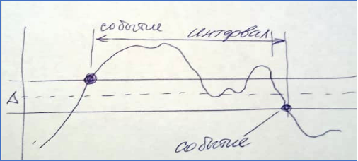
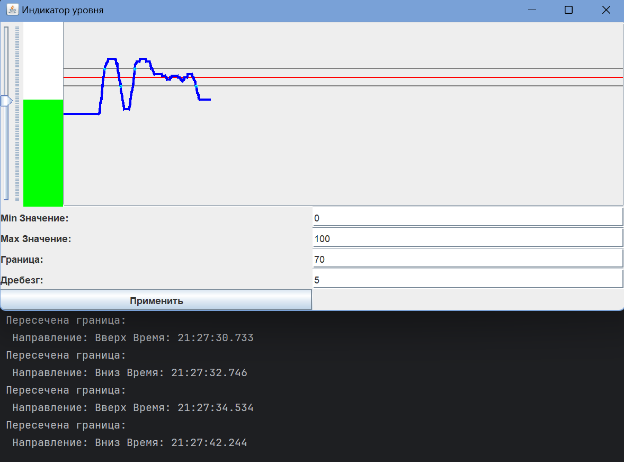



**Лабораторная работа №3**

**по дисциплине «Инжиниринг программного обеспечения»**

Разработка элемента GUI с динамическим поведением

Факультет: АВТФ

Группа: АВТ-141

Студенты: Кенин Е.Д., Половин Н.В.

Вариант: 9

Преподаватель: Романов Е.Л.

**Содержание**

[1.	Описание работы	3](#_toc179747872)

[2.	Описание паттернов	4](#_toc179747873)

[3.	Функциональное описание классов	5](#_toc179747874)

[4.	Результаты работы	10](#_toc179747875)

[5.	Вывод	11](#_toc179747876)

# **1.Описание работы**
Производный класс на основе базового элемента графического интерфейса (JPanel) с динамическим поведением. Класс способен накапливать, отображать и возвращать накопленные данные. При необходимости периодической передачи данных с определенной частотой получает при конструировании интерфейс слушателя события с методом *очередное значение данных*.

Индикатор уровня с CallBack по переходу через границу (компаратор). Изображает вертикальную полоску высотой, пропорциональной значению. При создании передается CallBack для событий пересечения границы: время, направление пересечения. Параметры настройки: минимальное и максимальное значение (диапазон отображения), граница и ширина границы (дельта гистерезиса для исключения «дребезга»).

Рисунок 1. График работы компаратора от времени.

# **2.Описание паттернов**
В данном приложении используются следующие паттерны проектирования:

**Model-View-Controller (MVC)**

**Model:** Класс Model хранит данные (историю значений, параметры модели) и выполняет логику по их изменению и обработке (например, проверка граничных значений с помощью BoundaryComparator).

**View:** Класс View отвечает за отображение интерфейса, управляет компонентами GUI, такими как JSlider, LevelIndicator, DataGraph, и обрабатывает взаимодействие с пользователем через контролы (например, кнопки и слайдер).

**Controller:** Класс Controller связывает модель и представление, обновляя модель при изменении значений в интерфейсе и передавая обновления обратно в представление.

**Observer:** Класс BoundaryComparator реализует поведение паттерна "Наблюдатель" через механизм обратного вызова (callback). Он принимает событие пересечения границы и уведомляет слушателя (переданный в конструктор Consumer<String>). В данном случае слушателем является анонимная функция, переданная в метод Model.

` `**Strategy:** Класс BoundaryComparator реализует логику проверки пересечения границы как отдельную стратегию, которая может быть использована в различных сценариях для разных моделей или графиков. Этот паттерн позволяет изменять логику граничных проверок без изменения самого класса Model.

**Command:** Слушатели событий для элементов управления, таких как кнопки (ActionListener для кнопки применения) и слайдер (ChangeListener), могут рассматриваться как команды. Эти обработчики инкапсулируют действия, которые нужно выполнить при взаимодействии пользователя с интерфейсом. Каждое действие (нажатие кнопки, изменение значения) представляет собой команду, которая влияет на модель и представление.

# **3.Функциональное описание классов**
В программе используется 7 классов: App, BoundaryComparator, Controller, DataGraph, LevelIndicator, Model, View.

1. **App**

Описание класса: Главный класс приложения, инициирует создание модели, представления и контроллера, а также запускает интерфейс в потоке событий Swing.

Методы:

***main(String[] args):*** Запускает графический интерфейс пользователя с использованием Swing. Создает модель, представление и контроллер. Отвечает за старт основного GUI-потока с использованием метода SwingUtilities.invokeLater().

1. **BoundaryComparator**

Описание класса: Класс для проверки пересечения значения с установленной границей. Отправляет уведомления о пересечении вверх или вниз с учетом гистерезиса, используя переданный callback.

Переменные:

***SimpleDateFormat dateFormat:*** Формат даты и времени для отображения времени события.

***int threshold:*** Граничное значение, которое нужно контролировать.

***int hysteresis:*** Значение гистерезиса для предотвращения дребезга.

***Consumer<String> boundaryEventHandler***: Callback для уведомления о событии пересечения границы.

Методы:

***BoundaryComparator(int threshold, int hysteresis, Consumer<String> boundaryEventHandler):*** Конструктор, инициализирует параметры и callback.

***checkBoundary(int previousValue, int currentValue):*** Проверяет, было ли пересечено граничное значение, и вызывает callback при необходимости.

***setThreshold(int threshold):*** Устанавливает новое значение границы.

***setHysteresis(int hysteresis):*** Устанавливает новое значение гистерезиса.

1. **Controller**

Описание класса: Управляющий компонент, связывает модель и представление, отвечает за обработку событий от пользователя и обновление интерфейса.

Переменные:

***Model model:*** Модель данных, содержащая логику и хранящая данные.

***View view:*** Представление, содержащее визуальные элементы интерфейса.

***Timer timer:*** Таймер для периодического обновления значений в модели и представлении.

Методы:

***Controller(Model model, View view):*** Конструктор, настраивает связь между моделью и представлением, устанавливает слушатели событий для слайдера и кнопки.

Вложенные анонимные классы для обработки событий от слайдера и кнопки.

***TimerTask run():*** Периодически обновляет значения в модели и интерфейсе через таймер.

1. **DataGraph**

Описание класса: Компонент, отображающий график накопленных данных с учетом граничных значений и гистерезиса.

Переменные:

***List<Integer> dataHistory:*** История данных для отображения на графике.

***int minValue, maxValue, threshold, hysteresis:*** Параметры для отображения данных и границ.

Методы:

***DataGraph():*** Конструктор, инициализирует пустую историю данных.

***setData(List<Integer> data, int minValue, int maxValue, int threshold, int hysteresis):*** Устанавливает данные и параметры графика для отображения.

***paintComponent(Graphics g):*** Отрисовывает график данных, а также линии порога и гистерезиса.

1. **LevelIndicator**

Описание класса: Компонент, отображающий вертикальную полоску, высота которой пропорциональна текущему значению. Используется для визуализации уровня.

Переменные:

***int minValue:*** Минимальное значение.

***int maxValue:*** Максимальное значение.

***int currentValue:*** Текущее значение для отображения.

Методы:

***LevelIndicator(int minValue, int maxValue):*** Конструктор, инициализирует минимальное и максимальное значение.

***updateValue(int value):*** Обновляет текущее значение и перерисовывает индикатор.

***paintComponent(Graphics g):*** Отрисовывает индикатор уровня в соответствии с текущим значением.

1. **Model**

Описание класса: Модель данных, хранящая историю значений, порог и гистерезис. Сравнивает новые значения с границей через BoundaryComparator.

Переменные:

***int minValue:*** Минимальное значение.

***int maxValue:*** Максимальное значение.

***int threshold:*** Граничное значение.

***int hysteresis:*** Гистерезис для предотвращения дребезга.

***List<Integer> dataHistory:*** История накопленных данных.

***BoundaryComparator boundaryComparator:*** Экземпляр для проверки пересечения границы.

Методы:

***Model(int minValue, int maxValue, int threshold, int hysteresis, Consumer<String> boundaryEventHandler):*** Конструктор, инициализирует параметры модели и задает callback для событий пересечения границы.

***addData(int value):*** Добавляет новое значение в историю и проверяет пересечение границ.

***setThreshold(int threshold):*** Устанавливает новое значение границы.

***setHysteresis(int hysteresis):*** Устанавливает новое значение гистерезиса.

***getDataHistory():*** Возвращает историю данных.

1. **View**

Описание класса: Интерфейс пользователя, содержит визуальные компоненты: слайдер, индикатор уровня и график данных, а также элементы управления для настройки параметров.

Переменные:

***JSlider slider:*** Слайдер для регулирования значений.

***JTextField minValueField, maxValueField, thresholdField, hysteresisField:*** Поля ввода для настройки минимального и максимального значений, порога и гистерезиса.

***JButton applySettingsButton:*** Кнопка для применения новых настроек.

***LevelIndicator levelIndicator:*** Компонент, отображающий текущий уровень.

***DataGraph dataGraph:*** Компонент, отображающий график истории данных.

Методы:

***View():*** Конструктор, настраивает элементы интерфейса, такие как слайдер, кнопки и график.

***updateLevelIndicator(int value):*** Обновляет индикатор уровня в соответствии с переданным значением.

***updateDataGraph(List<Integer> data, int minValue, int maxValue, int threshold, int hysteresis):*** Обновляет график данных и индикатор уровня.

***updateSliderRange(int min, int max):*** Устанавливает диапазон значений для слайдера.

***getSlider():*** Возвращает объект слайдера.

***getApplySettingsButton():*** Возвращает кнопку для применения настроек.

***getMinValueField(), getMaxValueField(), getThresholdField(), getHysteresisField():*** Возвращают соответствующие поля ввода.

***getDataGraph():*** Возвращает компонент графика для взаимодействия.
# **4.Результаты работы**
Графический интерфейс пользователя (GUI) состоит из следующих компонентов:

Слайдер находится в верхней части окна и позволяет пользователю вручную выбрать значение в заданном диапазоне. Поля для ввода минимального допустимого значения слайдера, максимального значения, порога, пересечение которого будет отслеживаться, значения гистерезиса, которое предотвращает слишком частые переключения из-за мелких колебаний. Кнопка "Применить настройки". Индикатор уровня, который визуализирует текущее значение слайдера в виде вертикальной полоски. Графика данных, который отображает историю изменений значений слайдера. Показывает, как изменяются данные со временем, а также визуализирует пороговое значение и область гистерезиса.

Рисунок 2. Работа приложения.

# **5.Вывод**
В ходе выполнения поставленной задачи был разработан производный класс на основе базового элемента графического интерфейса (JPanel) с динамическим поведением. Класс обладает функциональностью накопления, отображения и возврата данных, а также поддерживает периодическую передачу данных с определенной частотой через механизм таймеров.

Класс BoundaryComparator реализует логику отслеживания пересечения заданных порогов с учетом гистерезиса, предотвращая "дребезг" данных. При пересечении порога генерируется событие, в котором передаются время пересечения и направление изменения данных.

Таким образом, разработанный класс обеспечивает динамичное управление графическим индикатором уровня и накопление данных с возможностью гибкой настройки параметров отображения и отслеживания критических состояний через пороговые значения.

